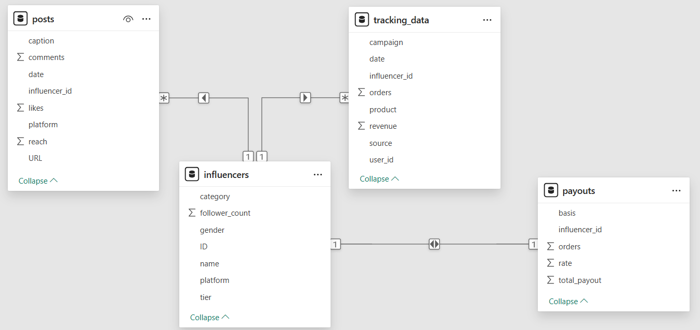
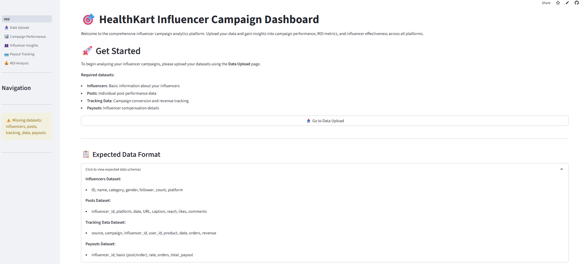
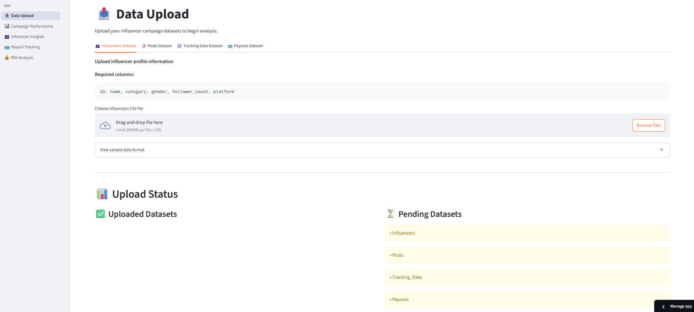
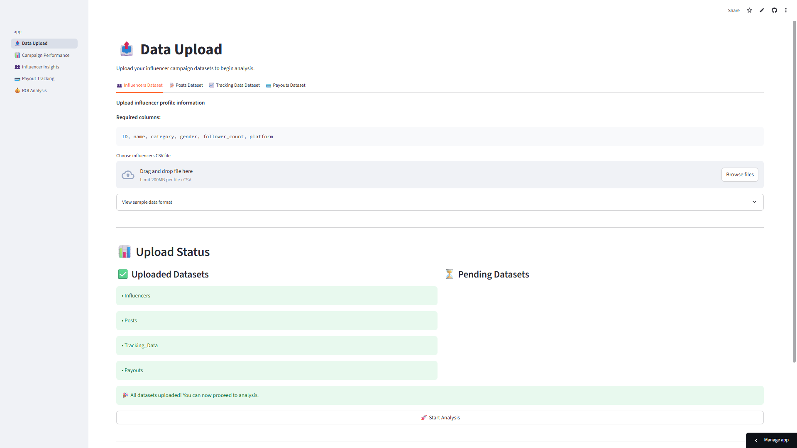
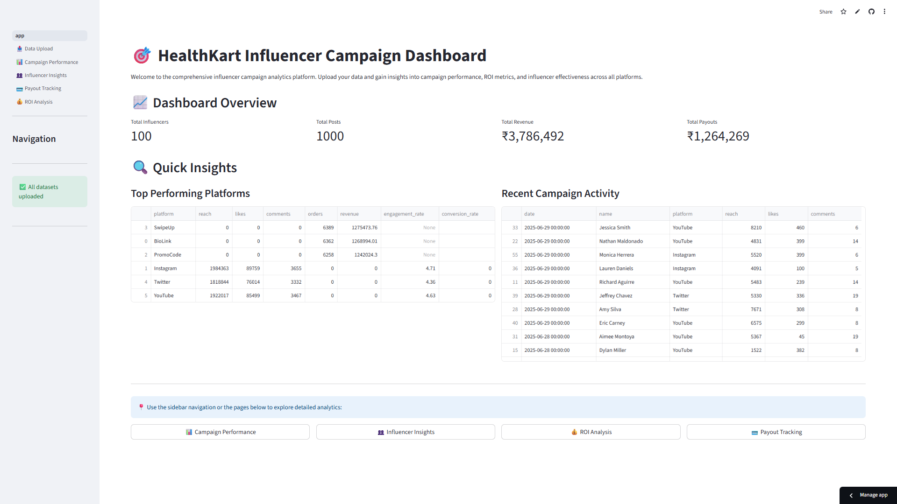

# 🎯 HealthKart Influencer Campaign Tracker

**A dynamic, no-code Streamlit dashboard enabling marketers to ingest custom influencer data, track campaign performance, and extract high‑impact ROAS insights.**

&#x20;  &#x20;

---

## 📌 Table of Contents

1. [🚀 About](#-about)
2. [📋 Context & Objective](#-context--objective)
3. [🔄 Project Workflow](#-project-workflow)
4. [🗂️ Data Model & Synthetic Generator](#️-data-model--synthetic-generator)
5. [🎨 Visual Showcase](#-visual-showcase)
6. - [📊 KPI Documentation](./KPI_Documentation.docx)  
7. [🚦 Usage Guide](#-usage-guide)
8. [📊 Key Insights](#-key-insights)
9. [📁 Project Structure](#-project-structure)
10. [⚙️ Installation & Setup](#️-installation--setup)
11. [🤝 Contributing](#-contributing)
12. [📄 License](#-license)

---

## 🚀 About

HealthKart Influencer Campaign Tracker is a dynamic, open‑source **Streamlit** dashboard built for marketing teams to ingest their own data, monitor campaign performance, calculate incremental ROAS, track influencer payouts, and unlock actionable insights—all in one place.

🔗 [**Try the Live Demo**](https://influencertracker-bysuman.streamlit.app)

---

## 📋 Context & Objective

HealthKart runs influencer campaigns across platforms like Instagram, YouTube, Twitter, etc., for brands such as MuscleBlaze, HKVitals, and Gritzo. These influencers are compensated per post or per order. Your mission:

1. 📊 **Track** influencer & campaign performance.
2. 💰 **Calculate** incremental ROAS.
3. 🔍 **Surface** high-impact insights at the influencer level.
4. 🧾 **Monitor** and **export** payout calculations.

---

## 🔄 Project Workflow

1. **Synthetic Data Generation**

   * Run Synthetic_data_generator.ipynb to produce four CSVs (influencers.csv, posts.csv, tracking_data.csv, payouts.csv) matching the assignment schema.

2. **Dashboard Development**

   * Craft an interactive Streamlit app using Plotly visuals and “vibe coding” UI principles (consistent palette, whitespace, large cards).

3. **Cloud Deployment**

   * Deploy on Streamlit Cloud:

     
bash
     streamlit deploy app.py

   * **🚀 Live Demo:** [influencertracker-bysuman.streamlit.app](https://influencertracker-bysuman.streamlit.app).

4. **Data Upload & Insights**

   * Go to **Data Upload** in the live app.
   * Drag & drop your own CSVs (must match schemas).
   * Instantly explore campaign metrics, influencer ROAS, payout details, incremental ROAS, and export reports.

> ⚠️ **Dynamic Data Only:** This is not a fixed‑data demo. You **must** upload your own datasets or try with my datasets available in this repo—structured exactly as specified—to power every chart and insight.

---

## 🗂️ Data Model & Synthetic Generator

### Table Schemas (CSV format)

| Table              | Columns                                                                                          |
| ------------------ | ------------------------------------------------------------------------------------------------ |
| **influencers**    | id, name, category, gender, follower_count, platform                                 |
| **posts**          | influencer_id, platform, date (YYYY-MM-DD), url, caption, reach, likes, comments |
| **tracking\_data** | source, campaign, influencer_id, user_id, product, date, orders, revenue         |
| **payouts**        | influencer_id, basis (order/post), rate, orders, total_payout                      |

### ER Diagram & Relationships

* **influencers** to **posts**: 1️⃣ → ⭐ (one influencer can have many posts).
* **influencers** to **tracking\_data**: 1️⃣ → ⭐ (orders tracked per influencer.
* **influencers** to **payouts**: 1️⃣ → ⭐ (each influencer has multiple payout entries).
* **posts** to **tracking\_data**: ⭐ → ⭐ via influencer\_id join (posts and tracking both link by influencer).

### Synthetic Data Generator

To simulate data for initial testing:

1. **Open** assets/Synthetic_data_generator.ipynb in Jupyter.
2. **Execute** all cells (or run headlessly with nbconvert).
3. **Locate** generated CSVs in the **assets/** folder.

\------------------ | ------------------------------------------------------------------------------------------------ |
\| **influencers**    | id, name, category, gender, follower_count, platform                                 |
\| **posts**          | influencer_id, platform, date (YYYY-MM-DD), url, caption, reach, likes, comments |
\| **tracking\_data** | source, campaign, influencer_id, user_id, product, date, orders, revenue         |
\| **payouts**        | influencer_id, basis (order/post), rate, orders, total_payout                      |

### Synthetic Data Generator

To simulate data for initial testing:

1. **Open** Synthetic_data_generator.ipynb in Jupyter.
2. **Execute** all cells (or run headlessly with nbconvert).
3. **Locate** generated CSVs in the project root.

---

## 🎨 Visual Showcase

### 1. App Home (Before Uploading Datasets)

### 2. Data Upload (Before Uploading Datasets)

### 3. Data Upload (After Uploading Datasets)

### 4. App Home (After Uploading Datasets)

> 🔗 **Explore more pages & generate insights:** [Live Dashboard](https://influencertracker-bysuman.streamlit.app)

---

## 🚦 Usage Guide

1. **Data Upload**

   * Navigate to the **Data Upload** tab.
   * Upload your four CSV files.
   * Preview your data and confirm column names/types.

2. **Campaign Performance**

   * Select date range & campaign filters.
   * View reach, engagement, orders, revenue KPIs.

3. **Influencer Insights**

   * Drill into category, platform, & demographic filters.
   * Identify top/bottom performers by ROAS.

4. **Payout Tracking**

   * Choose payout basis (post vs. order).
   * See influencer‑level cost breakdowns.

5. **ROI & ROAS Analysis**

   * Compare total vs. incremental ROAS.
   * Monitor daily ROI trend and segment high/low performers.

6. **Export**

   * Download filtered tables as CSV or PDF for presentations.

---

## 📊 Key Insights

1. **Link Channels Drive Revenue** 🔗
   100% of orders (19,009) and ₹3.78 M revenue came via SwipeUp, BioLink & PromoCode—despite \~6 M reach from Instagram/Twitter/YouTube.
   *Impact:* Scale link‑enabled formats for immediate ROI.

2. **Strong Unit Economics** 💹

   * **AOV:** ₹199 | **CPO:** ₹66 | **ROAS:** 3.0×
     *Impact:* Profitable link campaigns; safe to increase budget.

3. **SwipeUp’s Premium Edge** 📈
   Generates highest revenue (₹1.28 M) on par order counts—indicating higher‑value conversions.
   *Impact:* Negotiate premium rates for SwipeUp placements.

4. **Untapped YouTube Potential** 🎥
   YouTube leads in reach & engagement but records 0 tracked sales.
   *Impact:* Integrate trackable promo codes or link cards to convert that huge audience.

5. **Leaky Funnel Alert** 🚨
   4.57% engagement but only 0.33% conversion—optimize CTAs and tracking in organic posts.

6. **Portfolio Health** 🏆
   90% of influencers are profitable; top 90 generate ₹3.43 M revenue on ₹0.69 M spend (avg ROI \~397%).
   *Impact:* Double down on high performers; reallocate spend from the bottom 10%.

---

## 📁 Project Structure

├── assets/                      # Synthetic generator & sample datasets
│   ├── Synthetic_data_generator.ipynb
│   ├── influencers.csv
│   ├── posts.csv
│   ├── tracking_data.csv
│   └── payouts.csv
├── images/                      # Dashboard screenshots & diagrams
│   ├── app before.png
│   ├── app after.png
│   ├── data upload before.png
│   ├── data upload after.png
│   └── data modeling.png
├── streamlit_app/               # All Streamlit code & configs
│   ├── .streamlit/
│   ├── pages/
│   ├── utils/
│   ├── app.py
│   └── requirements.txt
├── README.md                    # This documentation
└── LICENSE                      # MIT License

---

---

## 🔧 Local Installation & Setup

bash
# 1. Clone the repo
git clone https://github.com/your-username/HealthKart-InfluencerTracker.git
cd HealthKart-InfluencerTracker

# 2. Create & activate virtual environment
python3 -m venv .venv
source .venv/bin/activate   # macOS/Linux
.venv\Scripts\activate    # Windows

# 3. Install dependencies
pip install -r requirements.txt

# 4. Run the Streamlit app:
streamlit run app.py --server.port 8501

## 🤝 Contributing

Contributions welcome!

1. Fork the repo
2. Create a feature branch (git checkout -b feat/YourFeature)
3. Commit changes (git commit -m 'Add feature')
4. Push & open a PR

---

## 📄 License

This project is licensed under the MIT License. See [LICENSE](LICENSE) for details.

---

> Built with ❤️ by **Suman Sadhukhan** | Hosted on Streamlit **Cloud**
